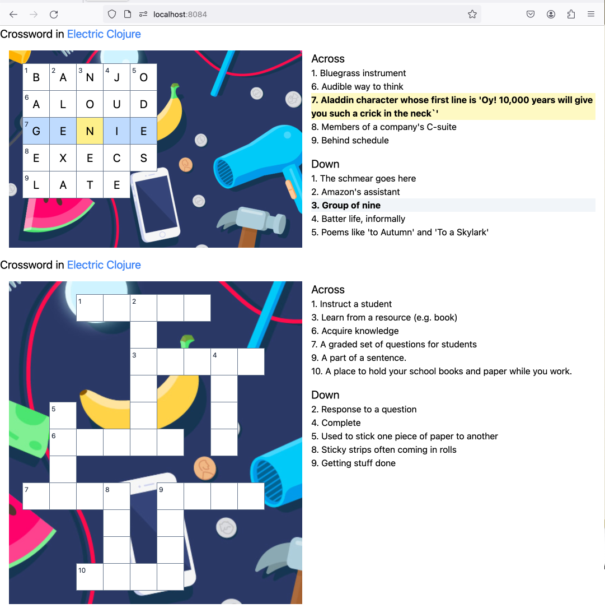

# Crossword puzzle (Electric Clojure)



* Designed for easy keyboard navigation within the browser, supporting arrow keys, tab, backspace, delete.
* Note the minimal puzzle declaration (and it infers the across/down numbers for you):

```clojure
(def example-cw-puzzle
  {:crossword/puzzle-string
   "#  TEACH
    #    N
    #    STUDY
    #    W  O
    # G  E  N
    # LEARN E
    # U
    #TEST WORD
    #   A O
    #   P R
    #  DESK"
   :crossword/clues
   {"TEACH"  "Instruct a student"
    "ANSWER" "Response to a question"
    "STUDY"  "Learn from a resource (e.g. book)"
    "GLUE"   "Used to stick one piece of paper to another"
    "LEARN"  "Acquire knowledge"
    "TEST"   "A graded set of questions for students"
    "TAPE"   "Sticky strips often coming in rolls"
    "WORK"   "Getting stuff done"
    "WORD"   "A part of a sentence."
    "DESK"   "A place to hold your school books and paper while you work."
    "DONE"   "Complete"}})
```

# Based on the Electric Starter App

A minimal Electric Clojure app, and instructions on how to integrate it into an existing app. For more demos and examples, see [Electric Fiddle](https://github.com/hyperfiddle/electric-fiddle).

## Instructions

Dev build:

* Shell: `clj -A:dev -X dev/-main`, or repl: `(dev/-main)`
* http://localhost:8084
* Electric root function: [src/electric_starter_app/main.cljc](src/electric_starter_app/main.cljc)
* Hot code reloading works: edit -> save -> see app reload in browser

Prod build:

```shell
clj -X:build:prod build-client
clj -M:prod -m prod
```

Uberjar (optional):

```
clj -X:build:prod uberjar :build/jar-name "target/app.jar"
java -cp target/app.jar clojure.main -m prod
```

Deployment example:
- [Dockerfile](Dockerfile)
- fly.io deployment through github actions: [.github/workflows/deploy.yml](.github/workflows/deploy.yml) & [fly.toml](fly.toml)

## Integrate it in an existing clojure app

1. Look at [src-prod/prod.cljc](src-prod/prod.cljc). It contains:
    - server entrypoint
    - client entrypoint
    - necessary configuration
2. Look at [src/electric_starter_app/server_jetty.clj](src/electric_starter_app/server_jetty.clj). It contains:
   - an example Jetty integration
   - required ring middlewares

## Build documentation

Electric Clojure programs compile down to separate client and server target programs, which are compiled from the same Electric application source code.

* For an Electric client/server pair to successfully connect, they must be built from matching source code. The server will reject mismatched clients (based on a version number handshake coordinated by the Electric build) and instruct the client to refresh (to get the latest javascript artifact).
* [src-build/build.cljc](src-build/build.clj bakes the Electric app version into both client and server artifacts.
  * server Electric app version is baked into `electric-manifest.edn` which is read in [src-prod/prod.cljc](src-prod/prod.cljc).
  * client Electric app version is baked into the .js artifact as `hyperfiddle.electric-client/ELECTRIC_USER_VERSION`

Consequently, you need **robust cache invalidation** in prod!
  * In this example, complied js files are fingerprinted with their respective hash, to ensure a new release properly invalidates asset caches. [index.html](resources/public/electric_starter_app/index.html) is templated with the generated js file name.
  * The generated name comes from shadow-cljs's `manifest.edn` file (in `resources/public/electric_starter_app/js/manifest.edn`), produced by `clj -X:build:prod build-client`. Watch out: this shadow-cljs compilation manifest is not the same manifest as `electric-manifest.edn`!
  * Notice that [src/electric_starter_app/server_jetty.clj](src/electric_starter_app/server_jetty.clj) -> `wrap-index-page` reads `:manifest-path` from config. The config comes from [src-prod/prod.cljc](src-prod/prod.cljc).
